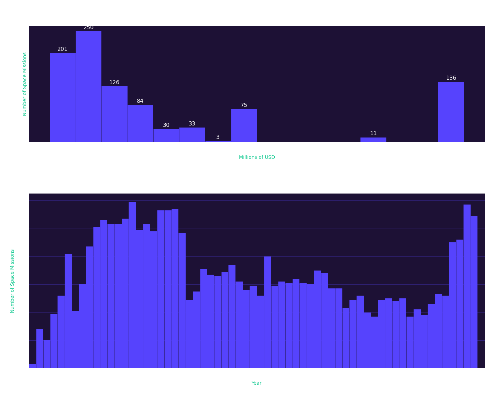

# Matplotlib-Histogram-Example
Code from the article - [Histograms with Python’s Matplotlib](https://towardsdatascience.com/histograms-with-pythons-matplotlib-b8b768da9305)  

  
"...we can see the space race taking shape from 57 to the late ’70s, and also a more recent increase in space programs in the last five years."  
  
[Full Article - Histograms with Python's Matplotlib](https://towardsdatascience.com/histograms-with-pythons-matplotlib-b8b768da9305)